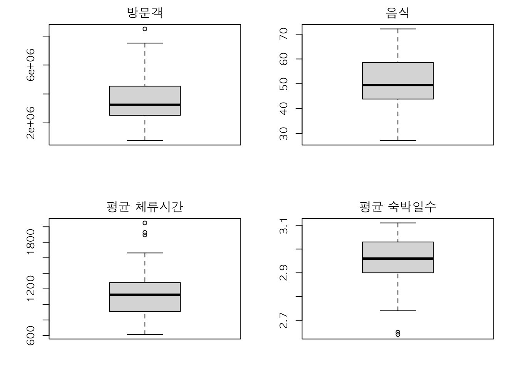

# 관광객 방문 요인 분석 보고서

## 서론
본 문서는 지역별 관광 특성 데이터가 방문객 수에 미치는 영향을 분석하기 위한 다중 선형 회귀분석의 전체 과정을 기록한다. 분석은 총 9단계로 구성되며, 각 단계별 수행 코드와 결과, 그리고 해석을 포함한다.

---

### 1. 변수 정의

본 분석은 지역별 방문객 수에 영향을 미치는 관광 요인을 파악하기 위해 수행되었다.
* **종속변수**: `방문객` (지역별 총 방문객 수)
* **독립변수**: 지역의 관광 특성을 나타내는 10개 변수 (`음식`, `문화관광`, `숙박`, `쇼핑`, `기타관광`, `역사관광`, `레저스포츠`, `체험관광`, `평균 체류시간`, `평균 숙박일수`)
* **분석 데이터**: 총 67개 지역(시군구)의 데이터

#### R 코드 및 실행 결과
```r
# 1단계: 변수 정의 (데이터 불러오기)
file_path <- "capston_cluster_analysis_data.xlsx"
df <- read_excel(file_path, sheet = "최종 데이터")

cat("--- 1. 데이터 확인 ---\n")
str(df)
head(df)
````

```
tibble [67 × 13] (S3: tbl_df/tbl/data.frame)
 $ 시군구명    : chr "서울강동구" "서울강북구" "서울관악구" "서울구로구" ...
 $ 음식        : num 59.3 44.3 60 35.6 33.4 40.1 62.1 43.5 30.6 44.3 ...
 $ 문화관광    : num 13.3 15.8 9.2 22.6 7.6 17.4 17.1 5.8 14.1 18 ...
 $ 숙박        : num 3.8 9.8 9.4 12.7 8.5 2.3 5.6 5.3 3.2 11.4 ...
 $ 쇼핑        : num 20.4 15.7 16 25 47.4 27.6 9.2 38.2 50.7 20.1 ...
 $ 기타관광    : num 0.2 1.3 0.1 0.1 0.1 2.1 0.4 4.4 0 0 ...
 $ 역사관광    : num 1.5 11.3 1.6 0.3 1.6 1.1 1.8 0.6 1 3.2 ...
 $ 레저스포츠  : num 1.3 1 1.9 1.3 0.7 6.9 3 1.8 0.2 1 ...
 $ 체험관광    : num 0.2 0.4 0.5 0.1 0.3 1.2 0.4 0.1 0 0.7 ...
 $ 자연관광    : num 0 0.4 1.4 2.4 0.3 1.4 0.4 0.2 0.1 1.3 ...
 $ 방문객      : num 4326581 2855251 5465222 5442454 2303752 ...
 $ 평균 체류시간: num 1356 1110 1269 863 1125 ...
 $ 평균 숙박일수: num 3.11 2.92 2.92 3 2.96 3.09 3.01 3.05 3.07 2.89 ...

# A tibble: 6 × 13
  시군구명   음식   문화관광  숙박   쇼핑   기타관광 역사관광 레저스포츠 체험관광 자연관광 방문객    `평균 체류시간` `평균 숙박일수`
  <chr>      <dbl>  <dbl>   <dbl>  <dbl>  <dbl>    <dbl>      <dbl>      <dbl>    <dbl>    <dbl>               <dbl>            <dbl>
1 서울강동구 59.3   13.3    3.8    20.4   0.2      1.5        1.3        0.2      0        4326581              1356             3.11
2 서울강북구 44.3   15.8    9.8    15.7   1.3     11.3        1          0.4      0.4      2855251              1110             2.92
3 서울관악구 60      9.2    9.4    16     0.1      1.6        1.9        0.5      1.4      5465222              1269             2.92
4 서울구로구 35.6   22.6   12.7    25     0.1      0.3        1.3        0.1      2.4      5442454               863             3
5 서울금천구 33.4    7.6    8.5    47.4   0.1      1.6        0.7        0.3      0.3      2303752              1125             2.96
6 서울노원구 40.1   17.4    2.3    27.6   2.1      1.1        6.9        1.2      1.4      5246258              1022             3.09
```

-----

### 2\. 데이터 전처리

* **결측치**: `colSums(is.na(df))` 실행 결과, 모든 변수에서 결측치가 발견되지 않아 데이터는 그대로 사용되었다.
* **이상치**: `boxplot` 시각화 결과, 종속변수인 `방문객`을 포함한 일부 변수에서 상위 값들이 평균에서 멀리 떨어진 이상치(outlier)가 관찰되었다. 이는 방문객이 월등히 많은 특정 지역이 존재함을 시사한다.

#### R 코드 및 실행 결과

```r
# 2단계: 데이터 전처리
cat("\n--- 2.1 결측치 확인 및 제거 ---\n")
print(colSums(is.na(df)))
df <- na.omit(df)

cat("\n--- 2.2 이상치 탐색 (Boxplot) ---\n")
par(mfrow = c(2, 2), mar = c(4, 4, 2, 1))
boxplot(df$방문객, main = "방문객")
boxplot(df$음식, main = "음식")
boxplot(df$`평균 체류시간`, main = "평균 체류시간")
boxplot(df$`평균 숙박일수`, main = "평균 숙박일수")
par(mfrow = c(1, 1))
```

```
--- 2.1 결측치 확인 및 제거 ---
      시군구명         음식     문화관광         숙박         쇼핑     기타관광     역사관광   레저스포츠     체험관광     자연관광       방문객 평균 체류시간 평균 숙박일수
             0            0            0            0            0            0            0            0            0            0            0            0            0
```



-----

### 3\. 탐색적 데이터 분석 (EDA)

* **기술통계량**: 방문객 수는 평균 약 356만 명이었으며, 최소 78만 명에서 최대 849만 명까지 넓은 분포를 보였다. 독립변수 중에서는 `음식` 관련 지표의 평균이 50.71로 가장 높은 값을 보였다.
* **상관분석**: 초기 모델의 독립변수 중 **`음식`(VIF=8.98), `문화관광`(VIF=6.59), `쇼핑`(VIF=9.75)** 변수들의 VIF 값이 높게 나타나 **다중공선성 문제**의 가능성이 제기되었다.

#### R 코드 및 실행 결과

```r
# 3단계: 탐색적 데이터 분석 (EDA)
cat("\n--- 3.1 기술통계량 확인 ---\n")
summary(df)

cat("\n--- 3.2 변수 간 상관관계 분석 ---\n")
numeric_vars <- df[, sapply(df, is.numeric)]
cor_matrix <- cor(numeric_vars)
corrplot(cor_matrix, method = "color", type = "upper", order = "hclust",
         addCoef.col = "black", tl.col = "black", tl.srt = 45)
```

```
--- 3.1 기술통계량 확인 ---
   시군구명               음식           문화관광           숙박              쇼핑          기타관광          역사관광        레저스포츠         체험관광          자연관광
 Length:67          Min.   :27.10   Min.   : 4.90   Min.   : 0.800   Min.   : 0.60   Min.   : 0.000   Min.   : 0.000   Min.   : 0.200   Min.   :0.0000   Min.   : 0.000
 Class :character   1st Qu.:43.85   1st Qu.: 8.85   1st Qu.: 3.950   1st Qu.: 7.75   1st Qu.: 0.500   1st Qu.: 0.500   1st Qu.: 1.050   1st Qu.:0.1000   1st Qu.: 0.300
 Mode  :character   Median :49.50   Median :11.20   Median : 6.200   Median :15.20   Median : 1.700   Median : 1.000   Median : 1.800   Median :0.2000   Median : 1.000
                    Mean   :50.71   Mean   :13.61   Mean   : 6.549   Mean   :16.10   Mean   : 4.461   Mean   : 1.925   Mean   : 3.472   Mean   :0.4493   Mean   : 2.727
                    3rd Qu.:58.55   3rd Qu.:16.40   3rd Qu.: 8.750   3rd Qu.:21.45   3rd Qu.: 7.100   3rd Qu.: 1.950   3rd Qu.: 5.000   3rd Qu.:0.4000   3rd Qu.: 4.100
                    Max.   :72.10   Max.   :59.70   Max.   :13.300   Max.   :50.70   Max.   :27.900   Max.   :12.400   Max.   :22.700   Max.   :6.3000   Max.   :18.300
     방문객         평균 체류시간  평균 숙박일수
 Min.   : 778361   Min.   : 612   Min.   :2.640
 1st Qu.:2524856   1st Qu.: 908   1st Qu.:2.900
 Median :3257072   Median :1125   Median :2.960
 Mean   :3557768   Mean   :1134   Mean   :2.953
 3rd Qu.:4536441   3rd Qu.:1280   3rd Qu.:3.030
 Max.   :8494150   Max.   :2049   Max.   :3.110
```


-----

### 4\. 모델 설정

* **분석 모형**: 방문객 수에 영향을 미치는 요인을 종합적으로 파악하기 위해 **다중 선형 회귀분석** 모형을 설정하였다.
* **초기 가설**: 10개의 모든 독립변수가 종속변수인 `방문객` 수에 유의미한 영향을 미칠 것으로 가정하고 초기 모델을 수립하였다.

-----

### 5\. 모형 추정

초기 모델(`initial_model`)의 분석 결과, \*\*수정된 결정계수(Adjusted R-squared)는 0.084 (8.4%)\*\*로 매우 낮았다. 또한 모델 전체의 통계적 유의성을 나타내는 F-statistic의 **p-value가 0.1285**로 유의수준 0.05보다 커, **초기 모델은 통계적으로 유의미하지 않은 것**으로 나타났다.

#### R 코드 및 실행 결과

```r
# 4단계 & 5단계: 모델 설정 및 추정
cat("\n--- 4 & 5. 초기 회귀모델 추정 결과 ---\n")
initial_model <- lm(방문객 ~ 음식 + 문화관광 + 숙박 + 쇼핑 + 기타관광 +
                    역사관광 + 레저스포츠 + 체험관광 + `평균 체류시간` + `평균 숙박일수`,
                    data = df)
print(summary(initial_model))
```

```
--- 4 & 5. 초기 회귀모델 추정 결과 ---
Call:
lm(formula = 방문객 ~ 음식 + 문화관광 + 숙박 + 쇼핑 + 기타관광 +
    역사관광 + 레저스포츠 + 체험관광 + `평균 체류시간` + `평균 숙박일수`,
    data = df)

Residuals:
     Min       1Q   Median       3Q      Max
-2865256  -748305  -163666   827203  5452064

Coefficients:
                   Estimate Std. Error t value Pr(>|t|)
(Intercept)      -1967047.7  7462492.3  -0.264   0.7931
음식                86983.8    50861.1   1.710   0.0928 .
문화관광            97331.2    53970.6   1.803   0.0767 .
숙박               113014.1    85803.1   1.317   0.1932
쇼핑               124811.4    48897.8   2.552   0.0134 *
기타관광            23129.9    55886.9   0.414   0.6806
역사관광            55770.1    79065.5   0.705   0.4835
레저스포츠          96932.6    72870.0   1.330   0.1888
체험관광           151293.6   193094.2   0.784   0.4366
`평균 체류시간`       584.8      803.6   0.728   0.4698
`평균 숙박일수`  -1435234.3  2454004.5  -0.585   0.5610
---
Signif. codes:  0 ‘***’ 0.001 ‘**’ 0.01 ‘*’ 0.05 ‘.’ 0.1 ‘ ’ 1

Residual standard error: 1405000 on 56 degrees of freedom
Multiple R-squared:  0.223,    Adjusted R-squared:  0.0842
F-statistic: 1.607 on 10 and 56 DF,  p-value: 0.1285
```

-----

### 6\. 가정 검토

* **오차의 독립성**: Durbin-Watson 검정 결과, p-value가 0.6744로 오차 항 간에 자기상관이 없어 독립성 가정을 만족하였다.
* **다중공선성**: VIF 확인 결과, `쇼핑`(9.75), `음식`(8.98) 등의 변수에서 기준치인 10에 가까운 높은 값이 측정되어 다중공선성 문제가 확인되었다.

#### R 코드 및 실행 결과

```r
# 6단계: 가정 검토
cat("\n--- 6.1 회귀진단 그래프 ---\n")
par(mfrow = c(2, 2))
plot(initial_model)
par(mfrow = c(1, 1))

cat("\n--- 6.2 오차의 독립성 검정 (Durbin-Watson) ---\n")
print(lmtest::dwtest(initial_model))

cat("\n--- 6.3 다중공선성 검사 (VIF) ---\n")
print(performance::check_collinearity(initial_model))
```

```
--- 6.2 오차의 독립성 검정 (Durbin-Watson) ---
    Durbin-Watson test

data:  initial_model
DW = 2.1565, p-value = 0.6744
alternative hypothesis: true autocorrelation is greater than 0

--- 6.3 다중공선성 검사 (VIF) ---
# Check for Multicollinearity

Moderate Correlation

       Term   VIF VIF 95% CI adj. VIF Tolerance Tolerance 95% CI
       음식  8.98 [6.30, 13.01]      3.00      0.11      [0.08, 0.16]
   문화관광  6.59 [4.67,  9.50]      2.57      0.15      [0.11, 0.21]
       쇼핑  9.75 [6.82, 14.13]      3.12      0.10      [0.07, 0.15]

Low Correlation

             Term   VIF VIF 95% CI adj. VIF Tolerance Tolerance 95% CI
             숙박  2.33 [1.78,  3.25]      1.53      0.43      [0.31, 0.56]
         기타관광  3.36 [2.48,  4.77]      1.83      0.30      [0.21, 0.40]
         역사관광  1.40 [1.17,  1.95]      1.18      0.71      [0.51, 0.85]
       레저스포츠  2.35 [1.80,  3.29]      1.53      0.43      [0.30, 0.56]
         체험관광  1.07 [1.00,  2.64]      1.03      0.94      [0.38, 1.00]
   평균 체류시간  2.00 [1.56,  2.79]      1.42      0.50      [0.36, 0.64]
   평균 숙박일수  2.01 [1.57,  2.79]      1.42      0.50      [0.36, 0.64]
```


-----

### 7\. 모델 진단 및 수정

초기 모델의 문제를 해결하기 위해 \*\*후진 소거법(backward elimination)\*\*을 사용하여 유의하지 않은 변수들을 제거하였다. 그 결과 `음식`, `문화관광`, `숙박`, `쇼핑`, `레저스포츠` 5개 변수만이 최종 모델에 남았으며, **다중공선성 문제가 해결**되었음을 확인하였다.

#### R 코드 및 실행 결과

```r
# 7단계: 모델 진단 및 수정
cat("\n--- 7. 최종 모델 선택 (Stepwise Selection) ---\n")
final_model <- step(initial_model, direction = "backward", trace = 0)
cat("\n--- 최종 모델 요약 결과 ---\n")
print(summary(final_model))

cat("\n--- 최종 모델 다중공선성 재확인 (VIF) ---\n")
print(performance::check_collinearity(final_model))
```

```
--- 최종 모델 요약 결과 ---
Call:
lm(formula = 방문객 ~ 음식 + 문화관광 + 숙박 + 쇼핑 + 레저스포츠,
    data = df)

Residuals:
     Min       1Q   Median       3Q      Max
-2843485  -758343   -55508   829784  5672851

Coefficients:
            Estimate Std. Error t value Pr(>|t|)
(Intercept) -3171175    2396283  -1.323 0.190650
음식           63614      28107   2.263 0.027190 *
문화관광       64493      27895   2.312 0.024169 *
숙박          114241      65503   1.744 0.086185 .
쇼핑           98610      26245   3.757 0.000386 ***
레저스포츠     83406      56137   1.486 0.142497
---
Signif. codes:  0 ‘***’ 0.001 ‘**’ 0.01 ‘*’ 0.05 ‘.’ 0.1 ‘ ’ 1

Residual standard error: 1363000 on 61 degrees of freedom
Multiple R-squared:  0.2032,    Adjusted R-squared:  0.1379
F-statistic: 3.112 on 5 and 61 DF,  p-value: 0.01445

--- 최종 모델 다중공선성 재확인 (VIF) ---
# Check for Multicollinearity

Low Correlation

      Term   VIF VIF 95% CI adj. VIF Tolerance Tolerance 95% CI
      음식  2.91 [2.13, 4.25]      1.71      0.34      [0.24, 0.47]
  문화관광  1.87 [1.45, 2.68]      1.37      0.53      [0.37, 0.69]
      숙박  1.44 [1.18, 2.08]      1.20      0.69      [0.48, 0.85]
      쇼핑  2.98 [2.17, 4.35]      1.73      0.34      [0.23, 0.46]
레저스포츠  1.48 [1.20, 2.13]      1.22      0.67      [0.47, 0.83]
```

-----

### 8\. 결과 해석

최종 모델(`final_model`)은 **통계적으로 유의미했으며(F-statistic p-value = 0.01445)**, \*\*수정된 결정계수(Adjusted R-squared)는 0.138 (13.8%)\*\*로 초기 모델보다 설명력이 향상되었다. 각 변수가 방문객 수에 미치는 영향은 다음과 같다:

* **`쇼핑`**: 가장 강력하고 유의미한 변수로 나타났다 (p \< 0.001).
* **`음식` 및 `문화관광`**: 두 변수 모두 유의수준 0.05 하에서 통계적으로 유의한 양(+)의 영향을 미쳤다.
* **`숙박`**: 유의수준 0.1 하에서 유의한 양(+)의 관계를 보였다.

-----

### 9\. 보고 및 활용

**결론**: 67개 지역의 방문객 수에 가장 큰 영향을 미치는 요인은 **쇼핑, 음식, 문화관광**인 것으로 나타났다.

**시사점**:

* 지역 관광 활성화를 위해서는 **쇼핑 인프라 확충, 특색 있는 음식 문화 개발, 그리고 문화 관광 자원 홍보**에 우선적으로 집중하는 전략이 효과적일 수 있다.
* 최종 모델의 설명력(13.8%)이 여전히 높지 않으므로, 방문객 수에 영향을 미치는 **다른 중요한 요인들(예: 교통 접근성, 지역 축제, 마케팅 예산 등)이 존재할 것**으로 추정된다.

#### R 코드 및 실행 결과

```r
# 9단계: 보고 및 활용
cat("\n--- 9. 회귀분석 결과표 생성 ---\n")
stargazer(initial_model, final_model, type = "text",
          title = "회귀분석 결과 비교",
          dep.var.labels = "방문객 수",
          covariate.labels = c("음식", "문화관광", "숙박", "쇼핑", "기타관광",
                               "역사관광", "레저스포츠", "체험관광",
                               "평균 체류시간", "평균 숙박일수"),
          align = TRUE)
```

```
--- 9. 회귀분석 결과표 생성 ---

회귀분석 결과 비교
===================================================================
                                  Dependent variable:
                  -----------------------------------------------
                                      방문객 수
                          (1)                      (2)
-------------------------------------------------------------------
음식                    86,983.790* 63,614.100**
                       (50,861.100)             (28,107.280)

문화관광                97,331.240* 64,492.700**
                       (53,970.600)             (27,894.740)

숙박                    113,014.100              114,241.200*
                       (85,803.080)             (65,502.860)

쇼핑                   124,811.400** 98,610.190***
                       (48,897.840)             (26,245.160)

기타관광                23,129.920
                       (55,886.950)

역사관광                55,770.110
                       (79,065.490)

레저스포츠              96,932.570               83,405.510
                       (72,869.990)             (56,137.160)

체험관광                151,293.600
                       (193,094.200)

평균 체류시간             584.806
                        (803.572)

평균 숙박일수         -1,435,234.000
                     (2,454,004.000)

Constant             -1,967,048.000           -3,171,175.000
                     (7,462,492.000)          (2,396,283.000)

-------------------------------------------------------------------
Observations                  67                      67
R2                          0.223                    0.203
Adjusted R2                 0.084                    0.138
Residual Std. Error 1,404,860.000 (df = 56) 1,363,039.000 (df = 61)
F Statistic         1.607 (df = 10; 56)      3.112** (df = 5; 61)
===================================================================
Note:                                   *p<0.1; **p<0.05; ***p<0.01
```

```
```